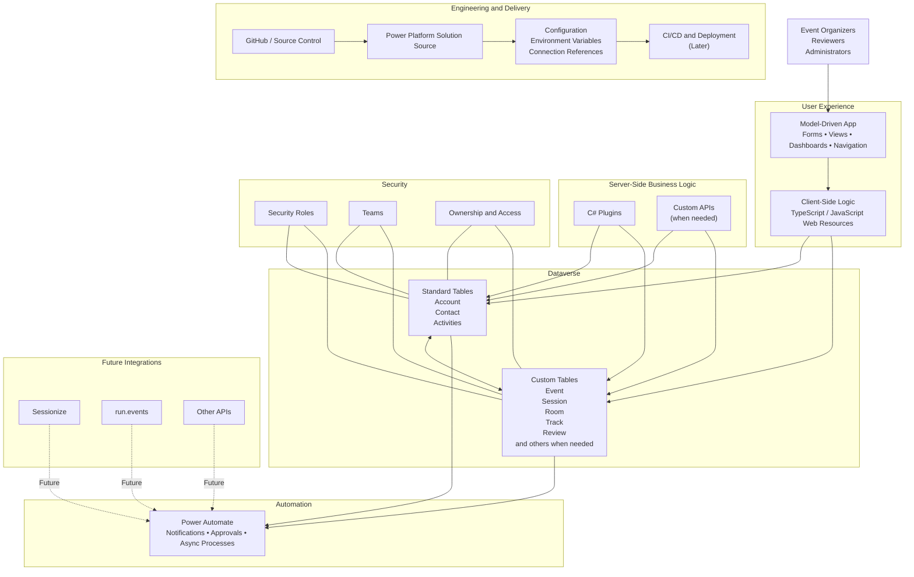

# Community Event Hub Architecture

This document describes the initial architecture of Community Event Hub.

The goal is to keep the project maintainable by separating user experience, data, business logic, automation, security, engineering, and future integrations.

The architecture will evolve as the project grows.

## Architecture Overview



## 1. User Experience

The main user interface for the first version of Community Event Hub will be a **Model-Driven App**.

It will provide access to:

- forms;
- views;
- dashboards;
- subgrids;
- navigation;
- commands;
- Dataverse data.

Client-side behaviour will be implemented only when needed using **TypeScript or JavaScript web resources**.

Typical client-side responsibilities may include:

- form behaviour;
- show or hide logic;
- lookup filtering;
- user feedback;
- client-side validation;
- user experience improvements.

Important business rules should not depend only on client-side logic because data can enter Dataverse through other channels such as imports, APIs, Power Automate, or integrations.

## 2. Dataverse Data Layer

Dataverse is the central data platform for Community Event Hub.

Before creating a custom table, we should first check whether Dataverse already provides a suitable standard table or platform capability.

### Standard Dataverse Tables

Examples we may reuse include:

- **Account** — organisations, sponsors, partners, venues, or other companies;
- **Contact** — speakers, reviewers, organisers, attendees, or other people;
- **Activities** — communication and work items such as:
  - Appointment;
  - Email;
  - Task;
  - Phone Call.

The goal is to avoid recreating platform capabilities with unnecessary custom tables.

At the same time, standard tables should not be forced to represent business concepts they were not designed for.

### Custom Tables

Custom tables will be created when Community Event Hub has its own domain concepts.

Examples may include:

- Event;
- Session;
- Room;
- Track;
- Session Review;
- other event-specific tables when required.

The final data model will be designed in a later episode.

## 3. Business Logic

Business logic will be separated based on responsibility.

### Dataverse Configuration

The first option should always be to check whether the platform itself can solve the requirement.

Examples include:

- required columns;
- relationships;
- choice columns;
- calculated or formula columns;
- duplicate detection;
- auditing;
- security;
- Business Rules;
- other Dataverse configuration.

### Client-Side Logic

Use TypeScript or JavaScript when the requirement is primarily related to the user experience.

Examples:

- dynamic form behaviour;
- filtering lookups;
- showing contextual information;
- client-side feedback;
- form-specific validation.

Client-side logic should not be the only enforcement point for critical business rules.

### Server-Side Logic

Use **C# plugins** when logic must run consistently regardless of where the data comes from.

Examples:

- important validation;
- state-transition rules;
- transactional logic;
- preventing invalid data;
- rules that must run during create or update operations.

**Custom APIs** may be introduced when the project needs a reusable server-side operation that should be called explicitly.

### Power Automate

Use Power Automate mainly for asynchronous and process-oriented work.

Examples:

- notifications;
- approvals;
- scheduled processes;
- asynchronous orchestration;
- external integrations;
- background processes.

Power Automate should not automatically become the place for every business rule.

## 4. Security

Security is part of the architecture from the beginning.

Community Event Hub may use:

- security roles;
- teams;
- record ownership;
- table and column permissions where required.

The exact security model will be designed when the application requirements become clearer.

Possible future roles may include:

- Event Administrator;
- Event Organizer;
- Reviewer.

These roles are examples only and are not final at this stage.

## 5. Engineering and Source Control

The project is developed using a solution-first and source-control-first approach.

The engineering flow will be:

```text
GitHub / Source Control
        ↓
Power Platform Solution Source
        ↓
Configuration
        ↓
Power Platform Environment
        ↓
CI/CD and Deployment (later)
```

The repository will eventually contain:

- Power Platform solution source;
- custom code;
- documentation;
- scripts where needed;
- deployment configuration when introduced.

Environment-specific values should not be hard-coded.

Where appropriate, the project should use:

- environment variables;
- connection references;
- configuration records.

CI/CD and deployment automation will be introduced later and are not part of the initial project foundation.

## 6. Future Integrations

Integrations are intentionally outside the initial project scope.

Possible future integrations include:

- Sessionize;
- run.events;
- other event or community APIs.

These systems are shown in the architecture because we know they may become relevant later.

However, Community Event Hub should first have a clear internal domain model and should not be designed around the structure of an external platform.

Future integrations should exchange data with the system without becoming the system itself.

## Business Logic Decision Guide

When a new requirement appears, we should ask these questions before choosing a technology:

```text
Requirement
    ↓
Can Dataverse handle it with platform configuration?
    ├─ Yes → Use Dataverse configuration
    └─ No
         ↓
Is it mainly user-interface behaviour?
    ├─ Yes → TypeScript / JavaScript
    └─ No
         ↓
Must it run synchronously or be enforced server-side?
    ├─ Yes → C# Plugin / Custom API
    └─ No → Power Automate / Async Plugin
```

This is a guideline, not a strict rule.

The final decision should depend on the business requirement, transaction boundaries, performance, maintainability, and where the logic needs to execute.

## Architecture Principles

The initial architecture follows these ideas:

1. Use the platform before writing custom code.
2. Reuse standard Dataverse capabilities when they fit the domain.
3. Create custom tables only for real domain concepts.
4. Keep client-side and server-side responsibilities separate.
5. Do not enforce critical business rules only in the browser.
6. Use Power Automate for appropriate asynchronous processes.
7. Treat security as part of the architecture, not an afterthought.
8. Keep configuration outside the code where possible.
9. Keep the core domain independent from future external integrations.
10. Let the architecture evolve as real project requirements appear.
