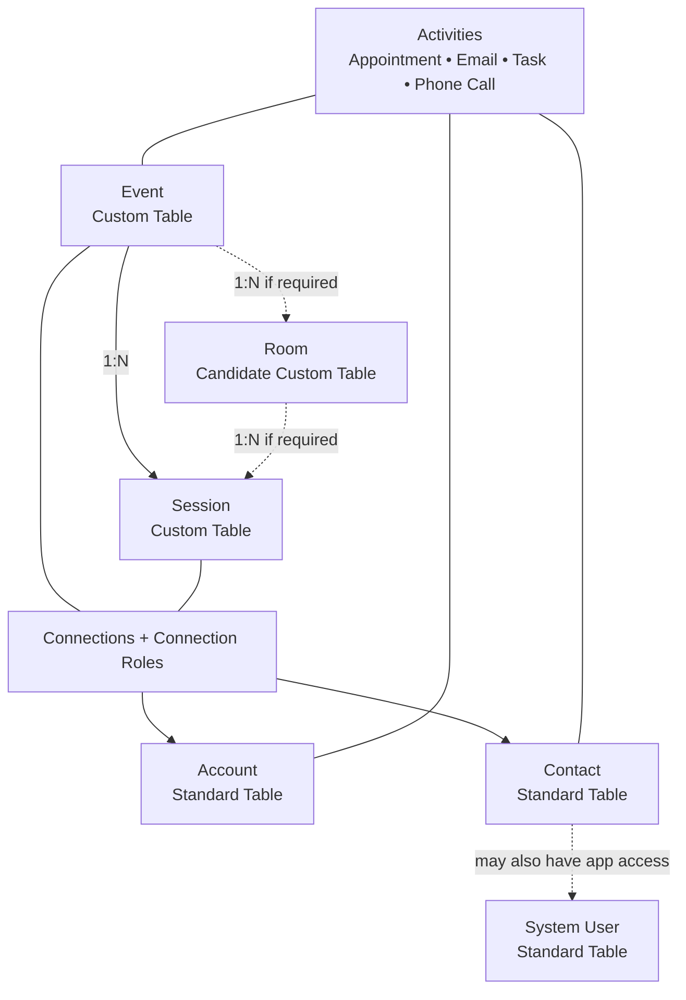

# Community Event Hub Data Model

This document describes the initial Dataverse data model for Community Event Hub.

The goal is to keep the model simple and maintainable by using standard Dataverse capabilities before creating custom tables.

A custom table should be introduced only when the business concept has its own meaningful data, lifecycle, or relationships.

The data model will evolve as the project grows.

## Design Principles

The initial model follows these rules:

1. Reuse standard Dataverse tables when they fit the business domain.
2. Use Connections and Connection Roles for flexible relationships between Events, Sessions, Accounts, and Contacts.
3. Use Choice columns for simple classifications such as status, type, tier, level, or format.
4. Create custom tables only for real Community Event Hub domain concepts.
5. Avoid creating a custom table only to represent a role.
6. Avoid creating duplicate relationships when Dataverse already provides a suitable capability.
7. Keep the first version small and extend it only when real requirements appear.

---

## Standard Dataverse Tables

Community Event Hub will reuse standard Dataverse tables where appropriate.

### Account

Account represents an organization.

Examples:

- event organizer;
- sponsor;
- partner;
- community organization;
- venue organization;
- company.

An Account should not have a permanent Community Event Hub type such as `Sponsor` or `Partner`.

The role of an Account can change between events and should therefore be represented through a Connection.

Example:

```text
Event A → Contoso → Sponsor
Event B → Contoso → Partner
Event C → Contoso → Organizer
```

### Contact

Contact represents a person.

Examples:

- speaker;
- organizer;
- volunteer;
- reviewer;
- sponsor representative;
- attendee.

A Contact should not have a permanent type such as `Speaker` or `Volunteer`.

The same person can have different roles for different events or sessions.

Example:

```text
Contact: John Smith

Event A → Speaker
Event B → Organizer
Event C → Volunteer
```

### System User

System User represents a person who has access to the Dataverse environment and application.

This is different from Contact.

```text
Contact
= person involved in the event domain

System User
= person who can sign in and work inside the application
```

Not every Contact needs to be a System User.

For example, an event may have many volunteers stored as Contacts while only a few organizers require access to the Model-Driven App.

The project will not introduce a custom table only to connect Contacts and System Users unless a real requirement appears.

### Activities

Standard Dataverse Activities should be reused for communication and operational work.

Examples:

- Appointment;
- Email;
- Task;
- Phone Call.

Possible Community Event Hub uses:

```text
Speaker rehearsal
→ Appointment

Speaker acceptance message
→ Email

Prepare event room
→ Task

Call sponsor
→ Phone Call
```

Custom activity-like tables should not be created when a standard Activity already represents the requirement.

---

## Connections and Connection Roles

Connections will be used to represent flexible relationships without creating a separate custom junction table for every role.

This allows the same Account or Contact to participate differently depending on the Event or Session.

### Connection Role Category

Community Event Hub uses a custom Connection Role Category to group the connection roles created for the project.

### Event to Account

Possible Connection Roles:

```text
Sponsor
Partner
Organizer
Venue
```

Example:

```text
Event
  │
  ├── Connection → Account: Contoso
  │                 Role: Sponsor
  │
  ├── Connection → Account: Community Group
  │                 Role: Organizer
  │
  └── Connection → Account: Partner Company
                    Role: Partner
```

### Event to Contact

Possible Connection Roles:

```text
Organizer
Volunteer
Reviewer
Staff
```

Example:

```text
Event
  │
  ├── Connection → Contact: John
  │                 Role: Organizer
  │
  ├── Connection → Contact: Anna
  │                 Role: Volunteer
  │
  └── Connection → Contact: Peter
                    Role: Reviewer
```

### Session to Contact

Possible Connection Roles:

```text
Primary Speaker
Co-Speaker
Moderator
```

Example:

```text
Session
  │
  ├── Connection → Contact: John
  │                 Role: Primary Speaker
  │
  └── Connection → Contact: Anna
                    Role: Co-Speaker
```

Using Connections avoids creating custom tables such as:

```text
Event Sponsor
Event Partner
Event Organizer
Event Volunteer
Session Speaker
```

unless the relationship later requires enough additional data or lifecycle to justify a dedicated custom table.

---

## Custom Tables

The first version should contain only the core business concepts that genuinely need custom tables.

### Event

Event is one of the main domain tables.

Possible initial columns:

```text
Name
Description
Start Date
End Date
Status
Format
```

Possible Choice columns:

#### Event Status

```text
Draft
Planning
Open
Running
Completed
Cancelled
```

#### Event Format

```text
In Person
Online
Hybrid
```

Additional columns should be introduced only when they are required.

---

### Session

Session should remain a custom table.

Although Dataverse Appointment contains scheduling information, a conference Session has its own business meaning and lifecycle.

Possible Session information includes:

```text
Title
Abstract
Event
Start Date/Time
End Date/Time
Status
Level
Session Type
Room
```

A Session may later have a lifecycle such as:

```text
Draft
Submitted
Under Review
Accepted
Rejected
Scheduled
Delivered
Cancelled
```

Possible Choice columns may include:

#### Session Status

```text
Draft
Submitted
Under Review
Accepted
Rejected
Scheduled
Delivered
Cancelled
```

#### Session Level

```text
Beginner
Intermediate
Advanced
All Levels
```

#### Session Type

Possible values may be introduced when requirements become clear.

Examples:

```text
Regular Session
Workshop
Keynote
Panel
Lightning Talk
```

The exact values are not final at this stage.

---

## Room

Room is currently a candidate custom table.

It should be created only if rooms need their own data and relationships.

Possible requirements may include:

```text
Name
Capacity
Location
Floor
Equipment
Accessibility Information
Event
```

If the project only needs a simple fixed room value, another solution may be enough.

If rooms differ between events and require their own information, a custom Room table becomes appropriate.

The final Room decision should be made when this requirement is implemented.

---

## Sponsor Tier

Sponsor Tier should initially be represented as a Choice rather than a separate custom table.

Possible values:

```text
Platinum
Gold
Silver
Bronze
```

Sponsor Tier only makes sense when an Account is connected to an Event with the Sponsor role.

The implementation should ensure that Sponsor Tier is used only for sponsor relationships.

If sponsorship later becomes more complex and requires information such as:

```text
Price
Benefits
Booth Size
Number of Tickets
Branding Package
Custom Packages Per Event
```

then Sponsorship Package may become a dedicated table.

Until then, a Choice is sufficient.

---

## Initial Relationships

The main formal relationship in the first version is:

```text
Event
  1
  │
  N
Session
```

If Room becomes a custom table:

```text
Event
  1
  │
  N
Room
```

and:

```text
Room
  1
  │
  N
Session
```

Flexible relationships with people and organizations should use Connections.

```text
Event
  ├── Connections → Accounts
  └── Connections → Contacts

Session
  └── Connections → Contacts
```

---

## Initial Data Model Overview



---

## Choice vs Connection vs Custom Table

When a new requirement appears, use this decision approach.

### Use a Choice when:

The value is a simple classification.

Examples:

```text
Status
Type
Tier
Level
Format
```

### Use a Connection when:

The requirement describes the role one record has in relation to another record.

Examples:

```text
Account → Sponsor of Event
Account → Partner of Event
Contact → Organizer of Event
Contact → Volunteer at Event
Contact → Speaker of Session
```

### Use a Custom Table when:

The concept has its own:

- meaningful attributes;
- lifecycle;
- relationships;
- reporting requirements;
- business logic.

Examples:

```text
Event
Session
Room (if required)
```

---

## Tables We Intentionally Do Not Create

The first version should avoid custom tables such as:

```text
Speaker
Sponsor
Partner
Organizer
Volunteer
Reviewer
Event Sponsor
Event Partner
Event Organizer
Event Volunteer
Session Speaker
Speaker Meeting
Speaker Email
```

These concepts can initially be represented using:

- Contact;
- Account;
- Connections;
- Connection Roles;
- standard Activities;
- Choice columns.

A dedicated table should be introduced later only if the business requirement justifies it.

---

## Current Initial Model

### Standard Tables

```text
Account
Contact
System User
Connection
Connection Role
Appointment
Email
Task
Phone Call
```

### Custom Tables

```text
Event
Session
```

### Candidate Custom Tables

```text
Room
```

This is intentionally a small starting model.

Community Event Hub should grow from real requirements instead of trying to predict the complete future database in advance.
